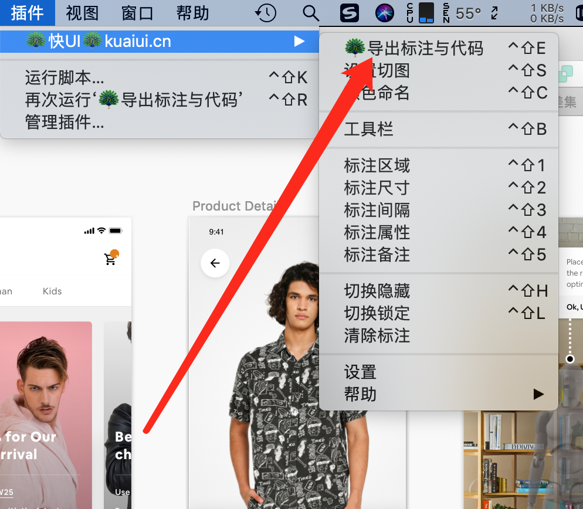
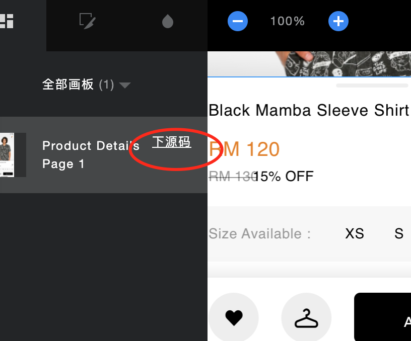
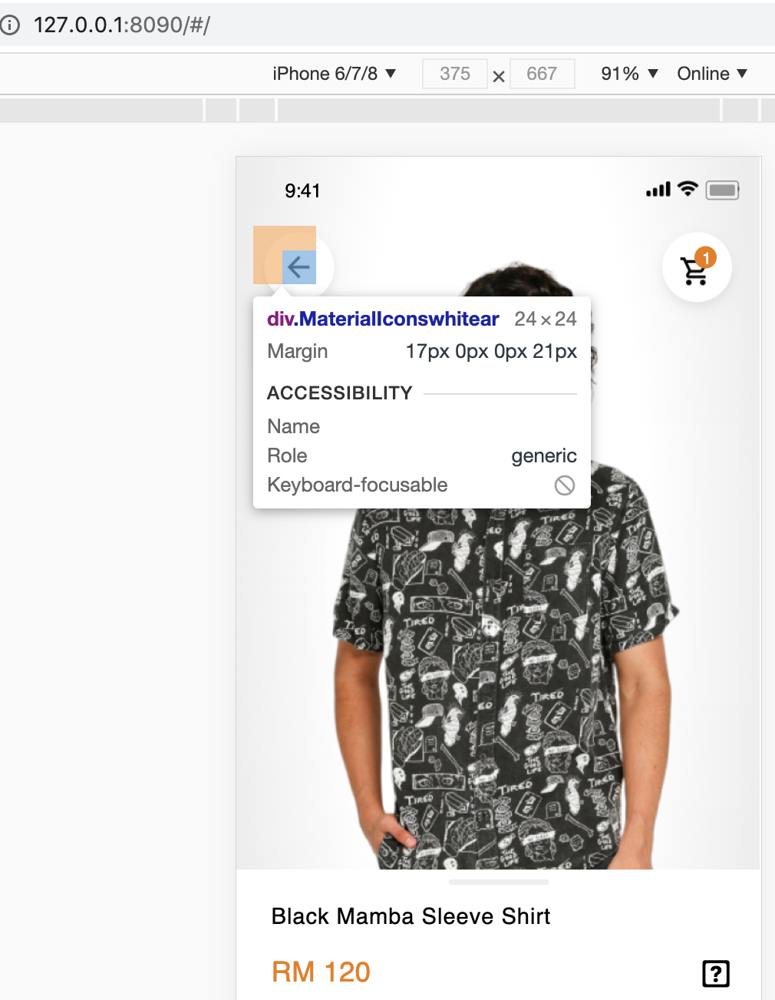

# sketch to html 设计图转html
- 由于经常写小程序，uniapp，react native都会用到前端技术
- 项目本来不开源，后面没时间维护，好多人加我qq咨询相关问题，于是开源代码出来供大家使用
- front-end-web目录为网站前端页面
- uploadsketch-server用于处理sketch插件上传的设计图的服务
- sketch-plugin是sketch插件，用该插件可以将设计图传到uploadsketch-server
- sketch-convert-html-toolserver是生成前端代码逻辑用户react，vue，html等使用
- kuaiui.sql是数据库结构需要提前导入数据库
- 大家都知道前端需要写前端页面，有时候这些页面要花50%的工作量，另外50%是对接接口和业务逻辑
- 今天给大家带来一个插件，直接设计图转前端代码，让你开发效率倍增
- 以下是插件截图，插件下载地址 https://kuaiui.cn/ 打开这个网站能首页有插件使用教程，3分钟学会使用sketch转html
- 
- 点击导出，然后去https://kuaiui.cn/   官网查看你的设计图，点击旁边的下载源码
- 
- 下载的源码在vue里面跑起来效果图如下：
- 

Thanks：The front-end of the plugin is based on SketchMeasure
